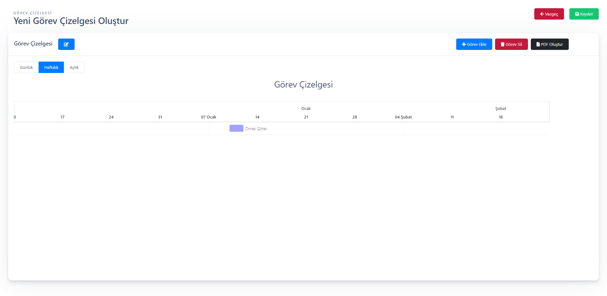

# Tulpar React Progress Event Web Application

Tulpar Yazılım is a Software Company and Consultants @ [TulparYazilim](https://www.tulparyazilim.com.tr/) | Embracing Technology | Creating Experiences
So this project is our base project for react native. You can just download and use it however you want.


 

## ⭐️ Base Features

⭐️ **frappe-gantt**

- You can use frappe gantt for styled gantt components. It is really simple to use. You can find some example components on "src/components" folder.

  Example:

  ```javascript
  import GanttChart from "../components/common/GanttChart";
  const ganttChartRef = React.createRef();
  <GanttChart ref={ganttChartRef} />;
  ```

⭐️ **firebase**

- You can use firebase for CRUD actions. For using Firebase you have to update "src/db/firebase.js".

  Example:

  ```javascript
  import firebase from "firebase";

  let config = {
    apiKey: "********",
    authDomain: "reactprogressevent.firebaseapp.com",
    projectId: "reactprogressevent",
    storageBucket: "reactprogressevent.appspot.com",
    messagingSenderId: "*****",
    appId: "******",
  };

  firebase.initializeApp(config);

  export default firebase.database();
  ```

⭐️ **html2canvas** and **jspdf**

- You can use html2canvas for transform html to canvas and jspdf for export canvas to pdf file. So it is really simple to creating pdf files.

⭐️ **react-toast-notifications**

- This package is very useful to show toast messages to user.

## 📫 Contact Us

- Email - [info@tulparyazilim.com.tr](mailto:info@tulparyazilim.com.tr)
- LinkedIn - [Tulpar Yazılım](https://www.linkedin.com/company/tulparyazilim)
- Blog - [Blog](https://www.tulparyazilim.com.tr/blog)

---


⭐️ From [Tulpar Yazılım](https://github.com/tulparyazilim)
